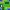
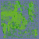
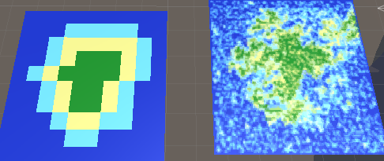
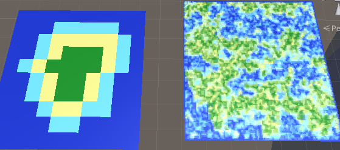
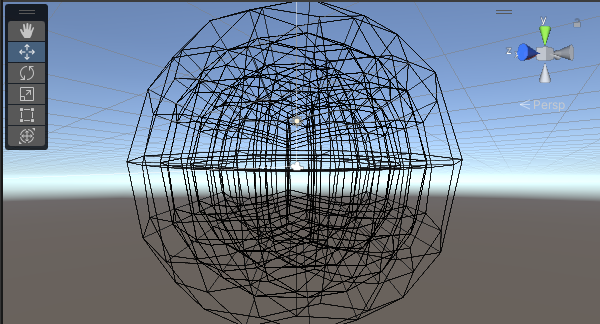
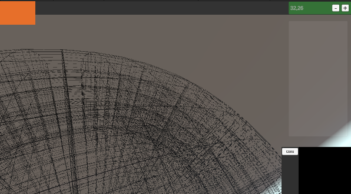

# BEYOND THE SPACE

/!\\ wip /!\\

## Map Generation

use of the Wave Function Collapse algo (modified) to generate 2d textures of map, each pixel being a biom

here the algo take the left img, find out rule about pixel position and generate the right img

->

settings can drastically alter the output from the same Input, from size to trying to match the original image

## Planet

The planet is a cube tricked into a sphere composed of multiples smaller cube named "case"

